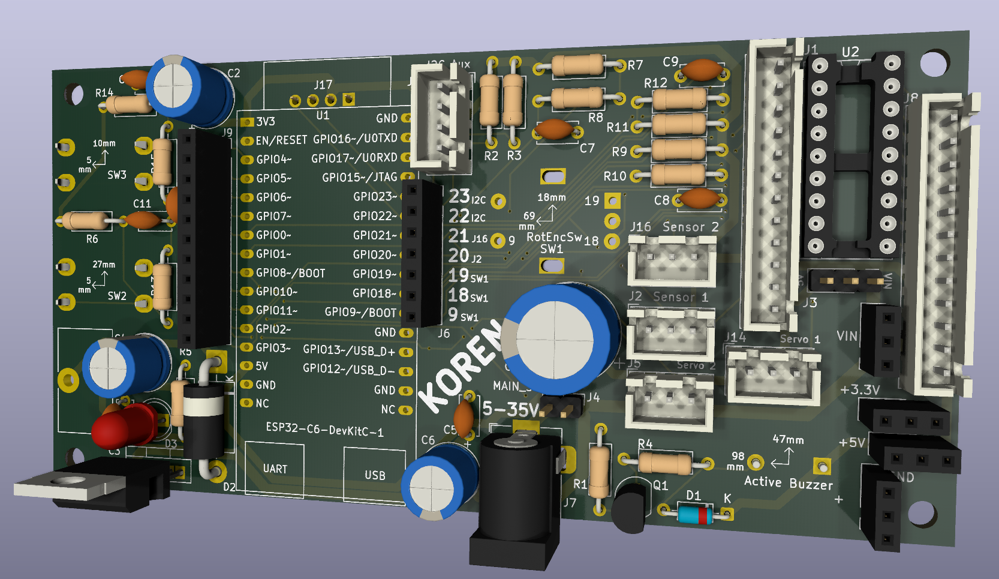
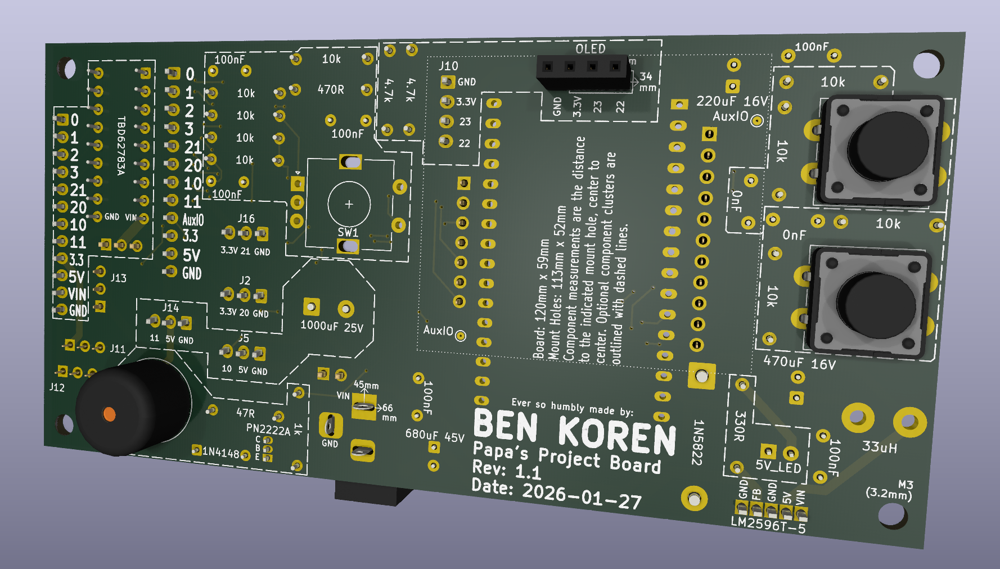
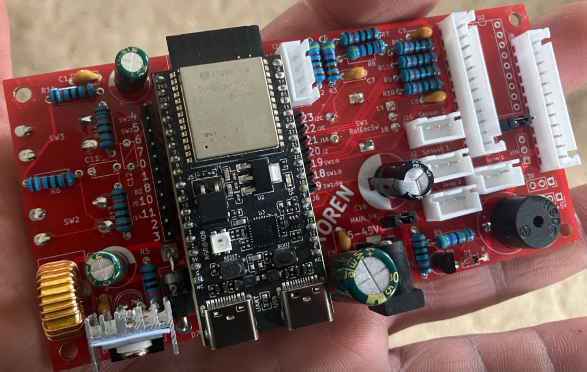
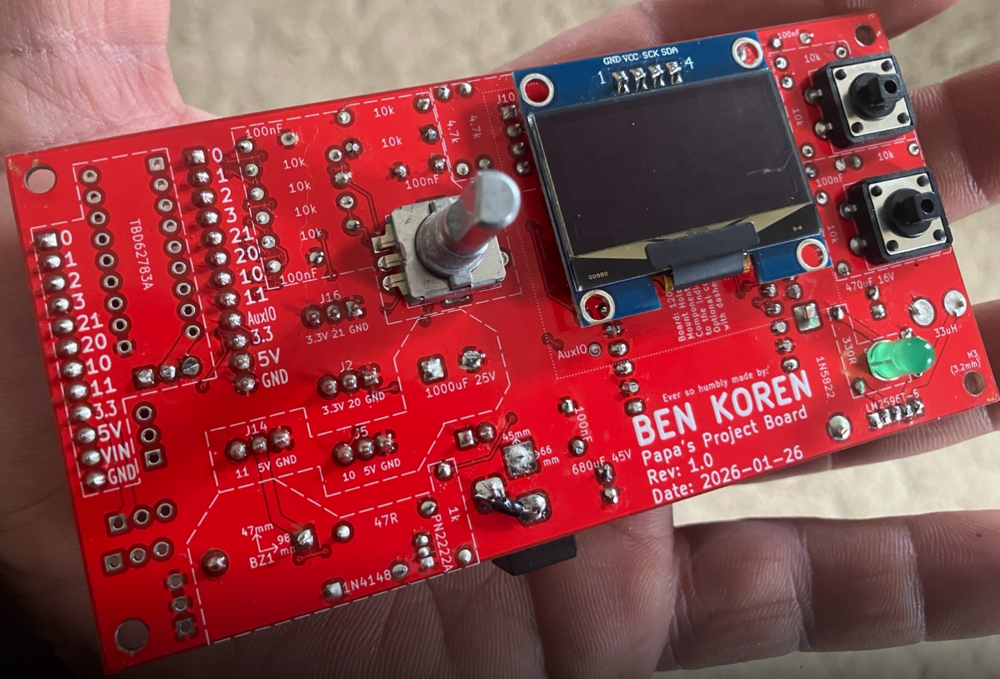
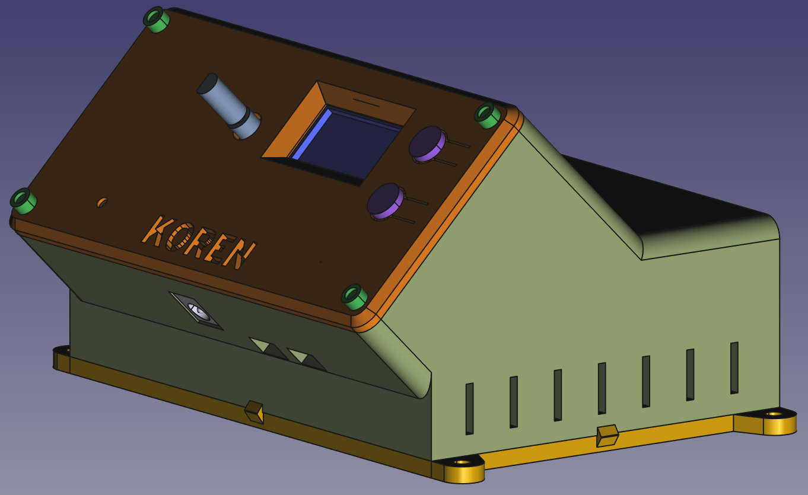
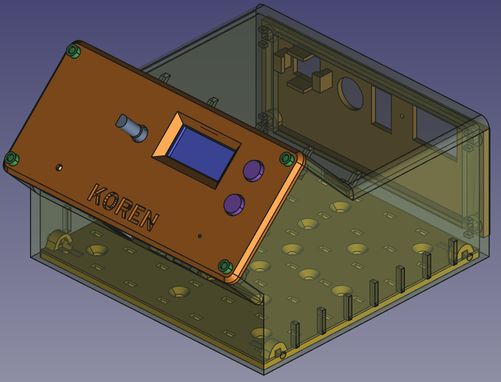

# papa-project-board

This is a universal controller board, centered around the ESP32-C6-DevkitC-1-N8 development board. It is meant to be a solid jumping off point for microcontroller-oriented projects which justify the beefy features of the C6 devkit, including JTAG, 32-bit RISC-V MCU & 2.4 GHz Wi-Fi 6 & Bluetooth 5 (LE) & IEEE 802.15.4, etc.

(TODO: INSERT YOUTUBE DEMO LINK)

## PCB

This universal controller board in particular includes:
 - 1.3" OLED (which you can swap for other sizes as well)
 - (2) 12mm momentary push-button switches
 - rotary encoder switch
 - active buzzer
 - (2) dedicated connectors for 3-pin sensors (ex: DHT-22)
 - (2) dedicated connectors (and extra capacitance) for driving servo motors
 - TBD62783A chip for driving things like relays while protecting our MCU
 - LM2596T-5 voltage regulator that allows the board to be driven by anywhere between 6 and 45 volts (enabling the use of a wide variety of DC power supplies)
 - 10-pin JST-XH connectors are meant to be the primary interface to the usable GPIO pins of the MCU, though extra header pins are included to facilitate tinkering on the benchtop as well
 - 4-pin JSH-XH connector used to extend the I2C devices beyond the included OLED display

For the particular components & footprints, I chose sizes that are easy to install and maintain over the long-term - all Through Hole Technology (THT) components, and no Surface Mount Device (SMD). Silkscreens were heavily utilized so that the user does not need the schematic to populate and maintain the board - all information needed is printed right on the board.

The PCB design was done in KiCad - all relevant files are located in the `KiCad` folder.

The overall approach and many schematic choices borrow a great deal from the [Banano Board by Electro Bananas](https://www.youtube.com/watch?v=pLuV-ciUMUs) - much gratitude goes to him for his work.

## Enclosure

In addition to the PCB design, I've created a corresponding 3d-printed dashplate which allows the board to be incorporated into any surface mount style application.

One such application is the included "Enclosure Y", which is a small enclosure that orients the input components of the controller board up and toward the user, a rear plate where power supply and other connectors are intended to enter, and a bottom-plate which includes a 20mm grid which allows other components to be secured with included mount trays and M3 bolts.

The enclosure design was done in FreeCAD - all relevant files are located in the `FreeCAD` folder.

## Code

Perhaps just as important as the PCB itself is how it's driven: I've created a code template as a great starting point for all projects based upon the universal controller board. It supports some foundational things like driving the OLED and responding to the various inputs included with the board. It's in a separate repository here: (TODO: LINK OTHER REPO)

## Important Changes Across Revisions

### 1.0 to 1.1
 - C11 and C12 are now 0nF - they are counterproductive when using interrupts for SW2 and SW3. We're going to just use software debouncing instead. 
 - R8 is now 470R
